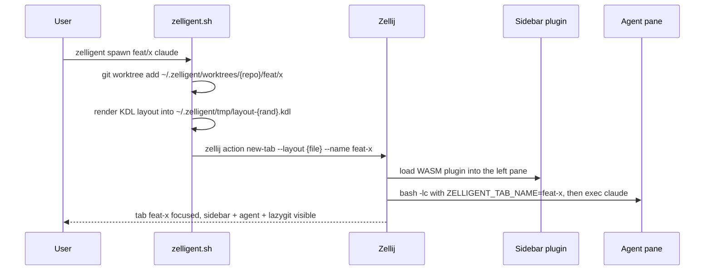
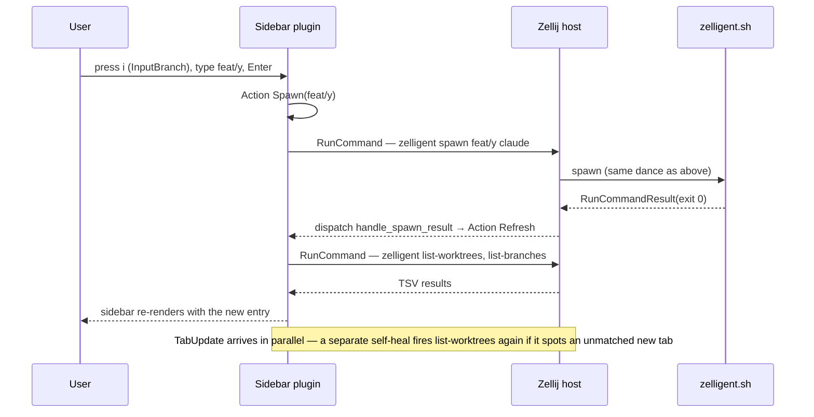
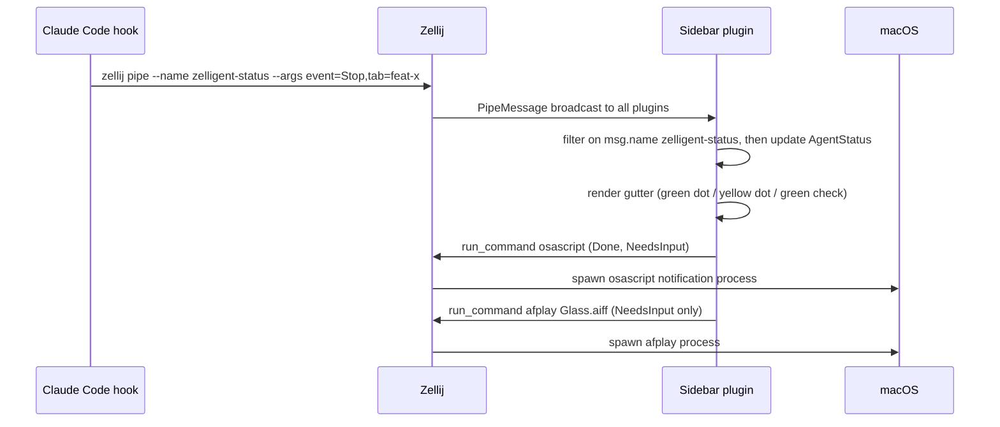

# Architecture

## What zelligent is, in one paragraph

Zelligent runs AI coding agents in isolated git worktrees, one per branch,
each in its own [Zellij](https://zellij.dev) tab with a persistent left
sidebar and a lazygit pane. It is a thin Bash CLI plus a Rust/WASM plugin
that lives inside Zellij. The CLI handles git, layouts, and process
lifecycle. The plugin handles the in-terminal UI — the sidebar, agent
status, and tab navigation. Together they turn "spawn an agent on this
branch" into a single tab in a Zellij session named after the repo.

## Why two components, not one

Zellij hosts plugins inside a WASI sandbox. A plugin can render to a pane
and call back into Zellij (open tabs, focus panes, run commands), but it
cannot shell out arbitrarily, fork processes, or block the host. So the
work splits naturally:

- **Things that need the host shell** (`git worktree add`, layout
  generation, environment variable propagation into the agent process) live
  in the **CLI**, which Zellij invokes via its `RunCommand` API.
- **Things that need to live with the tab** (always-visible sidebar UI,
  click and keyboard handling, real-time agent status from hooks) live in
  the **WASM plugin**, which Zellij hosts inside the sidebar pane.

This boundary is the single biggest design constraint and shows up in
nearly every feature. Treating it as a strict separation is how the
codebase stays small.

## The two components

### CLI — `zelligent.sh` (~1300 lines of Bash)

A Bash script installed as `zelligent`. Subcommands:

| Subcommand        | What it does                                                                                |
|-------------------|---------------------------------------------------------------------------------------------|
| `zelligent`       | Create or attach to a session named after the repo. The initial repo tab uses the sidebar layout (sidebar is a pane, not a separate tab). |
| `spawn`           | Create a git worktree at `~/.zelligent/worktrees/<repo>/<raw-branch>`, open a new tab named after the sanitized branch. |
| `remove`          | Delete the worktree and (when running inside Zellij) close its tab.                         |
| `doctor`          | One-shot setup: Zellij plugin permissions, default user layout, Claude Code hook plugin.    |
| `nuke`            | Force-kill the session, server, and resurrection cache. For "nothing else works" recovery. |
| `list-worktrees`  | Internal — emits a TSV the plugin parses via `RunCommand`.                                  |
| `list-branches`   | Internal — same idea, for the branch-picker UI.                                             |
| `show-repo`       | Internal — emits repo metadata for the plugin.                                              |

Key invariants the CLI enforces:

- **One repo = one session.** Session name = `basename(repo root)`, with
  the repo root resolved via `git rev-parse --git-common-dir` so it works
  identically from any worktree of the repo.
- **One branch maps to one managed worktree path.** Tab names are
  derived from the branch with `/` → `-` and non-`[A-Za-z0-9_-]`
  stripped; the plugin uses the same sanitization for best-effort
  identity. Worktrees can exist without an open tab, and user-created
  tabs can sit alongside managed ones.
- **Layouts are fragment-based.** The runtime layout source is
  per-repo `.zelligent/layout.kdl` if present, else the user-level
  `~/.zelligent/layout.kdl` (normally copied from
  `share/default-layout.kdl` by `doctor`). The layout contains
  placeholders `{{zelligent_sidebar}}` and `{{zelligent_children}}`,
  plus optional `{{cwd}}` and `{{agent_cmd}}`. See
  [references/zellij-kdl-layout.md](references/zellij-kdl-layout.md).

### Plugin — `plugin/` (Rust, compiled to `wasm32-wasip1`)

A Zellij plugin that renders the persistent left sidebar pane. ~3700 lines
of Rust split across `lib.rs` (state machine, event handling) and `ui.rs`
(ANSI rendering, viewport math).

State machine modes:

- `Loading` — bootstrap; waiting for first tab/worktree update
- `BrowseWorktrees` — the default; lists worktrees, lets you switch
  or spawn/remove
- `SelectBranch` — pick from existing branches to make a new worktree
- `InputBranch` — type a new branch name
- `Confirming` — `y/n` confirmation for destructive ops
- `NotGitRepo` — graceful fallback when sidebar loads outside a repo

What the plugin does NOT do:

- It does not create or remove worktrees or mutate git refs directly.
  Worktree lifecycle (create, delete) goes through CLI
  `spawn` / `remove`. The plugin can invoke host actions like
  `dump_session_layout` and external processes (`osascript`/`afplay`
  for notifications) — but always via Zellij's plugin API, never by
  calling `libc` directly.
- It does not bundle binaries or fonts. ANSI + Unicode only; the
  earlier powerline-glyph dependency was removed (commit `4238cff`)
  because it complicates installs and breaks string matching in tools
  that strip non-printable bytes.

## How the components interact

Spawn from inside Zellij (the simplest case; the CLI also handles
outside-Zellij + existing-session and outside-Zellij + no-session
modes — see `SPAWN_MODE` in `zelligent.sh`):

Note the path/name asymmetry: the worktree on disk uses the **raw**
branch name (`feat/x` → `.../{repo}/feat/x`), but the Zellij tab name
uses the sanitized form (`feat-x`).

Sidebar-driven spawn (from inside the sidebar):

Agent status (hooks → plugin → notifications):

See [design-docs/agent-notifications.md](design-docs/agent-notifications.md)
for the full pipeline and the `ZELLIGENT_TAB_NAME` propagation trick.

### Sidebar cache refresh triggers

Each tab's sidebar is a separate plugin instance with its own `worktrees`
cache, and Zellij delivers Events (`TabUpdate` etc.) only to instances in
the visible tab — a hidden instance is event-starved and its snapshot
freezes at the moment its tab lost focus. Pipes, by contrast, broadcast to
all instances and are the only channel that reaches hidden ones. Silent
self-heal `Refresh`es (no status message) therefore fire in
`handle_tab_update` on four conditions, OR-ed into a single Refresh per
`TabUpdate`: a newly-appeared tab with no matching worktree, a
previously-known tab that has disappeared, the tab set changing in any way
relative to the instance's previous snapshot (subsumes the first two), and
the `cache_dirty` bit being set. The set-diff heals a starved instance
whose catch-up `TabUpdate` (received when its tab becomes active again)
shows net drift — but a worktree spawned AND removed entirely inside the
blind window leaves zero net drift, which only the pipe path catches: the
CLI (and the plugin itself, after its own spawn/remove completes)
broadcasts a `zelligent-invalidate` pipe; every instance marks
`cache_dirty` and fires an immediate Refresh. Visible instances complete
it on the spot; a hidden instance loses the command result, so the durable
dirty bit re-fires the Refresh on every `TabUpdate` until a successful
`list-worktrees` clears it — the first such retry lands right as the tab
becomes visible. "Successful" is guarded by a generation counter,
`invalidate_generation`, bumped each time `cache_dirty` is set: a refresh
already in flight when a new invalidation lands is stamped with the OLDER
generation, so its (still-applied) result cannot clear the bit the newer
invalidation set — only a refresh launched at-or-after the latest
invalidation can prove the cache reflects it. Without this guard, a stale
in-flight refresh could clear the bit out from under a still-pending
invalidation; if that pending refresh's own result is then lost to a
hidden instance, the cache would be stuck stale with no retry trigger
left (#140). A pure focus switch with no set drift and a clean cache
doesn't refresh, and the tab-set triggers don't fire on the very first
`TabUpdate` since startup, since the bootstrap path already loads
worktrees. See
[references/zellij-plugin-api.md](references/zellij-plugin-api.md) for the
event-delivery model.

**Failure handling (#216 / #219).** A refresh that fails — e.g. Zellij can't
even spawn the command under EMFILE (`os error 24`) on a low `ulimit -n`
with many worktrees — must not turn a transient failure into a permanent
spin. A single lifecycle (`pump_refresh`, driven via `Action::Refresh` and
pumped by the update/pipe shell after *every* event) unifies five concerns:

- **Request identity.** Each launch bumps `refresh_seq` and stamps it into
  the context as `CTX_REQUEST_ID`; the in-flight request is `refresh_inflight
  = (id, launched_at)`. Only a result whose id matches the current in-flight
  request may touch state or fire the follow-on branch fetch — so a
  timed-out-then-relaunched request's late result can't clear the newer
  request's guard, overwrite its state, or double-spawn branches.
- **In-flight guard + timeout.** Refreshes can't stack; a result lost to a
  hidden instance ages out after `REFRESH_IN_FLIGHT_TIMEOUT_SECS`, and
  `pump_refresh` reaps it (and reveal abandons any in-flight request, whose
  result was lost while hidden) so nothing wedges.
- **Exponential backoff** (`refresh_backoff_secs`, `REFRESH_BACKOFF_INITIAL_SECS`
  doubling to `REFRESH_BACKOFF_MAX_SECS`) suppresses auto-retries after a
  failure, so a persistent failure stops respawning on every `TabUpdate`. A
  manual `r` and a genuine `zelligent-invalidate` reset it.
- **Deferral, not drop.** A trigger that arrives while the gate is closed sets
  `refresh_pending` (drained the moment the gate reopens) instead of being
  lost — a tab-set change or invalidate mid-refresh always eventually runs.
- **One consolidated wake-up scheduler, accounting for uncancellable timers.**
  `next_wakeup_deadline` computes the single earliest instant *anything* needs
  a wake-up for: the status-message TTL expiry, the refresh in-flight timeout,
  the backoff expiry, or the `cache_dirty_since + STALE_GRACE_SECS` grace
  boundary. But `set_timeout` arms an untagged one-shot that CANNOT be
  cancelled, so when an earlier deadline preempts an already-armed later one,
  the old timer stays queued and still delivers. Crucially, zellij *always*
  delivers a `set_timeout` timer — it is directed and reaches even a hidden
  instance, never lost (verified in zellij-server 0.44.3). So the scheduler
  simply *accounts* for outstanding arms: `outstanding_arms` holds the
  fire-times of the queued one-shots, and it mirrors the real host timers by
  construction — every push is retired by exactly one future delivery.
  `schedule_wakeup` arms ONE more host timer only when no remaining arm already
  fires at-or-before the desired deadline (using the same `WAKEUP_FLOOR_SECS`
  floor for the coverage check as for the arm, so a sub-floor deadline isn't
  re-armed every event) — a whole window of events collapses to one timer, and
  a preempting earlier deadline adds at most one. Each delivered `Event::Timer`
  retires the earliest arm via `retire_earliest_arm` — nothing else removes
  entries (there is deliberately NO time-based purge: it could drop an arm
  whose delayed Timer is still queued, whose delivery would then misretire a
  different arm). A stale late delivery therefore retires its own arm and
  re-arms nothing — no duplicate, and the count is bounded by the number of
  in-flight preemptions (≈2). Invariant (debug-asserted every schedule): a
  desired deadline is covered by an outstanding arm, so a wake-up is never lost.
  The grace boundary being a scheduled deadline is what makes the stale marker
  *appear* with no other event; the Timer/reveal paths repaint when `is_stale()`
  differs from the last painted frame (`last_rendered_stale`), and a reveal
  always repaints (so a status message cleared while hidden is redrawn away).
- **Hidden instances don't spin the refresh lifecycle.** While `!is_visible`,
  `next_wakeup_deadline` omits the refresh deadlines, the Timer path and the
  `update`/`pipe` tails skip `pump_refresh`, and `request_refresh` only RECORDS
  `refresh_pending`/`cache_dirty`. So a hidden instance never wakes to
  reap-and-relaunch `list-worktrees`, and a broadcast invalidate/status pipe
  (which reaches hidden instances) can't drive one either. `is_visible` is
  authoritative ONLY from `Event::Visible(true/false)` and from genuine user
  input (`Key`/`Mouse`, which reach only a focused pane) — NOT from a
  `TabUpdate`/`PaneUpdate` or a directed `RunCommandResult`/
  `PermissionRequestResult`, all of which zellij delivers to background
  instances too (verified in zellij-server 0.44.3), so treating them as proof
  of visibility would un-hide a hidden instance and reopen its pumps. Bootstrap
  and the `r`-key refresh still work: the active sidebar gets `Visible(true)`,
  and a keystroke marks visibility directly. The owed refresh survives in
  `refresh_pending`/`cache_dirty`, and the reveal path (which abandons any
  in-flight request and pumps) drains it. Status expiry is still scheduled
  while hidden — it spawns no process — so a message can clear on its own.

Because the branch list is consumed only by the `n` picker, `list-branches`
is fetched lazily — only alongside a *successful* worktree refresh — so the
failing path spawns one doomed process per attempt, not two (#219). The
failed refresh keeps the last known list on screen (usable-but-flagged beats
blank). Staleness is displayed by `is_stale()`, which derives from BOTH a
failed refresh (`refresh_error`, distinct from the TTL'd `status_message`)
AND an unsatisfied invalidation (`cache_dirty`): the marker shows as soon as
no refresh is resolving the invalidation, or — if one is — once the dirtiness
has outlived `STALE_GRACE_SECS` (`cache_dirty_since`), so a hung or
repeatedly-timing-out replacement can't leave a known-stale list unflagged,
while a healthy sub-grace refresh never flickers the marker. `refresh_error`
clears on any success but a stale-generation success keeps `cache_dirty` set,
so the marker persists until a *current-generation* success. The full error
is recoverable on demand via the `e` key. The marker occupies one budgeted
layout row; on an undersized pane both the populated and empty-state arms
degrade through the same budget (footer collapses to its version line, header
drops, item viewport may reach zero) rather than overflow. The empty-state
body is budgeted in *physical* rows at the pane width, so a wide instruction
line wrapping to two rows can't silently overflow, and meaningful text is kept
(headline first) while blank separators are dropped first.

## Key files

| File                                       | Purpose                                                       |
|--------------------------------------------|---------------------------------------------------------------|
| `zelligent.sh`                             | CLI entry point. All git and zellij-process invocations.      |
| `plugin/src/lib.rs`                        | Plugin state machine, event handling, command dispatch.       |
| `plugin/src/ui.rs`                         | ANSI rendering, viewport math, color/glyph constants.         |
| `share/default-layout.kdl`                 | Shipped default sidebar layout fragment.                       |
| `claude-plugin/plugins/zelligent/hooks/`   | Claude Code hooks that emit `zellij pipe` status events.       |
| `claude-plugin/plugins/zelligent/skills/`  | Bundled Claude skill: `zelligent-spawn-claude`.                |
| `.claude/skills/`                          | Project-local Claude skills: `dev-install`, `release`, `tmux`. |
| `.claude/agents/`                          | Specialized subagents: `rust-zellij-reviewer`, `test-driver`.  |
| `.claude/hooks/pre-push-block.sh`          | Push gate: requires `DOCS_VERIFIED=1` prefix on `git push`.    |
| `dev-install.sh`                           | Build wasm + symlink CLI to `~/.local/bin`. Local development. |

## Cross-cutting constraints worth knowing

These are the gotchas that have bitten us most often. Each has a dedicated
design doc.

- **Tab position ≠ tab index.** Zellij has an internal tab index, but
  what `TabUpdate` exposes via `TabInfo.position` is the visual
  position; APIs like `close_tab_with_index` expect the internal
  index, which the plugin can't get reliably from `TabUpdate`. The
  workaround is name-based tab operations everywhere. See
  [design-docs/tab-management.md](design-docs/tab-management.md).
- **Per-plugin `cwd=` is dropped on session resurrection.** Upstream
  Zellij's KDL emitter doesn't preserve it; on rehydrate the plugin gets
  the server's startup `cwd` instead. Worked around with a `repo_root`
  config field that the CLI always sets. See
  [design-docs/session-resurrection.md](design-docs/session-resurrection.md).
- **`kill_sessions(&[&name])` kills the plugin process.** Anything after
  that call in the same handler doesn't run.
- **WASM plugins inherit host env.** `std::env::var("ZELLIJ_SESSION_NAME")`
  works inside the plugin because Zellij calls `builder.inherit_env()` on
  the WASI engine. This is how the plugin discovers its session.
- **`set_timeout` is not a replaceable single-shot slot.** Each call
  spawns an independent one-shot host timer; calling it again before an
  earlier one fires does NOT cancel it, so several `Event::Timer`s can be
  in flight at once — and hidden instances receive no Events, so a timer
  can be lost outright. The footer `status_message` TTL (8s, #152)
  therefore treats `Event::Timer` as a wake-up only: expiry is decided by
  the message's age (WASI monotonic clock), which is immune to both stale
  and lost timers, with `Event::Visible(true)` lazily clearing/re-arming
  on reveal — see `State::set_status`/`State::handle_timer`/
  `State::handle_visible` in `plugin/src/lib.rs`.

## Where things live in the worktree

| Path                                       | What                                                        |
|--------------------------------------------|-------------------------------------------------------------|
| `~/.zelligent/worktrees/<repo>/<branch>`   | The actual worktree directories.                            |
| `~/.zelligent/tmp/`                        | Temporary rendered fragment/session layout files passed to Zellij (`--new-session-with-layout` and `action new-tab --layout`). |
| `~/.config/zellij/config.kdl`              | Plugin permissions wired up by `zelligent doctor`.          |
| `~/.config/zellij/layouts/zelligent.kdl`   | Default user layout, also installed by `doctor`.            |
| `~/.local/share/zelligent/zelligent-plugin.wasm` | Where the plugin wasm is installed.                    |
| `~/Library/Caches/org.Zellij-Contributors.Zellij/...` | Upstream resurrection cache (we don't write to it). |

## Related docs

- [BUILD.md](BUILD.md) — build & test commands, push gate.
- [TESTING.md](TESTING.md) — every test layer, what it catches, what it doesn't.
- [BUILDING_WITH_AGENTS.md](BUILDING_WITH_AGENTS.md) — how Claude / Codex /
  Gemini participate in the dev loop.
- [PRODUCT_SENSE.md](PRODUCT_SENSE.md) — UX rules and conventions.
- [CONVENTIONS.md](CONVENTIONS.md) — code conventions, Zellij gotchas.
- [design-docs/index.md](design-docs/index.md) — full design-doc index.
