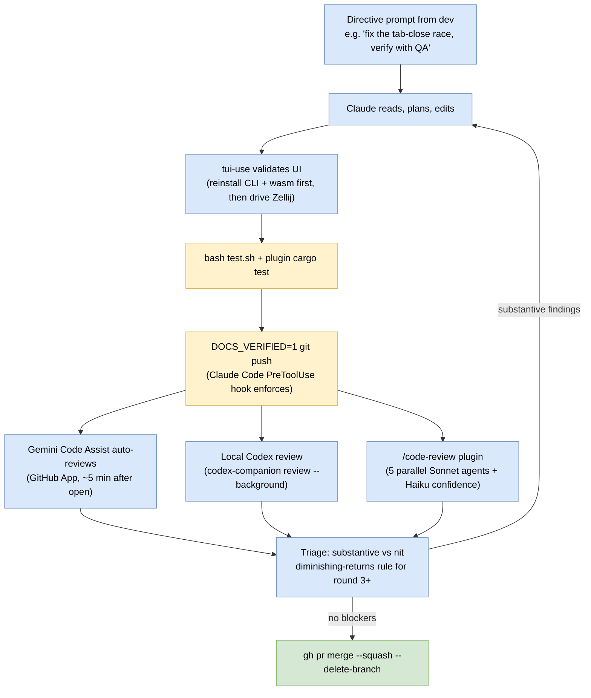

# Building zelligent with agents

Zelligent is itself developed with AI coding agents. This doc describes
how that actually works, reconstructed from ~600 Claude Code session
logs, the on-disk tooling, and the project-memory feedback files that
capture what was learned the hard way. Not the prescriptive ideal; the
actual practice.

## The setup

The developer runs **Claude Code** as the primary agent, with a small
set of installed plugins doing specialized review and UI-driving work
on the side. The plugins live in the developer's local Claude Code
config; the in-repo `claude-plugin/` ships only the hooks (for agent
status notifications) and the `zelligent-spawn-claude` skill.

| Tool | Where it lives | What it's for |
|------|----------------|---------------|
| Claude Code | `claude` CLI | Primary developer. Reads, writes, tests, opens PRs. |
| `tui-use` | `@1debit/tui-use` Claude Code plugin | PTY automation. Drives real Zellij sessions to validate UI changes. **The dominant validation tool** (≈300 invocations in the local logs vs ~13 for the tmux skill). |
| `/code-review` | `claude-code-plugins/code-review/1.0.0` | Multi-agent PR review. Launches 5 parallel Sonnet agents, scores each finding 0–100 with a Haiku, posts only ≥80-confidence findings. |
| `codex-companion` | `@openai/codex` + a wrapper script | Local Codex review. `node codex-companion.mjs review --background --base origin/main --scope branch` runs an independent OpenAI Codex review against the branch diff. |
| `codex:codex-rescue` | Claude Code subagent | "I'm stuck, take over." Used to delegate when the parent agent has been spinning. Rare but load-bearing. |
| Gemini Code Assist | GitHub App | Auto-reviews every newly opened PR within ~5 minutes. Posts as `gemini-code-assist[bot]`. Re-trigger with `/gemini review` comments on later pushes. |
| `gemini -p` | `@google/gemini-cli` | Manual Gemini reviews for one-off correctness checks outside the PR flow. |
| `advisor` tool | Built-in (stronger model) | Pre-substantive-work and pre-declaration sanity checks. Sees the full conversation. ~30 uses in the local logs. |

## What's in the repo vs in the developer's setup

**In the zelligent repo:**

- `claude-plugin/plugins/zelligent/hooks/hooks.json` — Claude Code hooks
  that fire on `UserPromptSubmit` / `Stop` / `Notification(permission_prompt)`
  and pipe status events to the sidebar plugin via `zellij pipe`.
- `claude-plugin/plugins/zelligent/skills/zelligent-spawn-claude/SKILL.md`
  — bundled skill that teaches an agent how to spawn other agents via
  `zelligent spawn`.
- `.claude/skills/dev-install/`, `.claude/skills/release/`,
  `.claude/skills/tmux/` — project workflows.
- `.claude/agents/test-driver.md`, `.claude/agents/rust-zellij-reviewer.md`
  — defined subagent personas. Rarely invoked in the actual logs;
  validation usually happens via direct `tui-use` from the main agent.
- `.claude/hooks/pre-push-block.sh` — `PreToolUse` hook that refuses
  Claude Code `Bash` invocations of `git push` unless the command also
  contains `DOCS_VERIFIED=1`. Forces docs-current acknowledgment from
  the agent. Doesn't affect a human pushing in their own shell.

**In the developer's local Claude Code (`~/.claude/`):**

- `tui-use`, `code-review`, `codex` plugins
- The Gemini and Codex CLI binaries
- Per-project auto-memory files in
  `~/.claude/projects/<sanitized-path>/memory/` — feedback rules that
  encode lessons like "always run Codex review before self-merge" and
  "tab position ≠ tab index". These are NOT in the zelligent repo; a
  fresh setup re-learns them.

## How a feature actually ships

The developer drives. Most work is one directive prompt to the main
Claude agent, which reads the codebase, edits, dogfoods, and pushes.
Sub-agent spawning (`zelligent spawn`) exists and works, but in
practice the user delegates by *direction* more than by *spawning*.
The `zelligent-spawn-claude` skill was invoked only twice across all
zelligent sessions — it's a feature, not the day-to-day pattern.

## Dogfooding is load-bearing

The single biggest source of friction is that **`~/.local/bin/zelligent`
and the wasm are snapshots, not symlinks**. Editing the source doesn't
change runtime behavior until you reinstall. The `dev-install` skill
encapsulates the right sequence (build wasm for `wasm32-wasip1`, copy
both artifacts in, optionally `zelligent nuke` to clear the
resurrection cache). Every UI-validation round starts with a
reinstall. Skip it and you're testing the previous version.

## Review calibration rules that emerged from practice

Captured in the local memory files; not in the repo. Distilled:

- **Run Codex review on every non-trivial PR before self-merge.** Use
  `--base origin/main --scope branch`; the default scope is
  working-tree and returns "no changes" post-commit. False-negative
  trap.
- **Don't sit idle waiting for Gemini.** Arm a `watch-pr-reviews`
  Monitor right after pushing so the review notification lands in
  chat.
- **Reply to every reviewer comment** in the same round. Silent skips
  drift over time.
- **Calibrate accept/reject per finding.** Accept findings that hit
  the PR's contract, a real bug, or a documented guarantee. Push back
  on cosmetic parity or defensive detail the PR didn't promise.
- **Diminishing-returns rule.** When round N's only finding is a
  strictly-narrower morphological tweak to the same artifact from
  round N-1 (same regex, same docstring, same tripwire), decline and
  self-merge with a tracking issue. After three accept-and-iterate
  rounds with no substantive finding, the prior shifts to bikeshedding.
- **Codex posts at two endpoints.** The `chatgpt-codex-connector[bot]`
  posts as a pull-request review (with inline comments), not an issue
  comment. Check both `/pulls/<N>/reviews` and `/pulls/<N>/comments`
  — checking only issue comments misses the review entirely.
  Self-merging on the basis of a missed Codex review has happened.

## Agent status notifications via Claude Code hooks

When `zelligent doctor` runs, it installs the bundled Claude Code
plugin at `claude-plugin/plugins/zelligent/`. The hooks fire on three
Claude Code events and pipe status to the sidebar plugin:

| Hook event | When | Pipe event | Sidebar effect |
|------------|------|-----------|----------------|
| `UserPromptSubmit` | Dev sends a prompt to Claude | `Start` | Status → Working (green dot) |
| `Notification(permission_prompt)` | Claude asks for tool approval | `PermissionRequest` | Status → NeedsInput (yellow) + sound |
| `Stop` | Claude finishes a turn | `Stop` | Status → Done (green check) + desktop notification |

Each hook runs `zellij pipe --name zelligent-status --args
event=<X>,tab=$ZELLIGENT_TAB_NAME`. The plugin filters on
`msg.name == "zelligent-status"` and updates per-tab status. The
`ZELLIGENT_TAB_NAME` env var is injected by `zelligent spawn` into
the agent pane and propagates to every child process.

Full pipeline: [design-docs/agent-notifications.md](design-docs/agent-notifications.md).

## Project memory

`~/.claude/projects/<sanitized-path>/memory/MEMORY.md` (and the
related `feedback_*.md` files) accumulate the "this surprised me
once, let's not be surprised twice" facts. Examples from the
zelligent project memory:

- WASM plugins inherit host env vars (`std::env::var` works).
- `split_direction="Vertical"` is the left/right split, not
  top/bottom — counterintuitive, breaks the sidebar layout if you
  get it wrong.
- `dump-layout` normalizes split direction to lowercase.
- `TabInfo.position` ≠ tab index; use name-based ops.
- `kill_sessions(&[&name])` terminates the plugin's own process —
  nothing after that call runs.
- `~/.local/bin/zelligent` and `.wasm` are snapshots, not links.

These survive across conversations and seed each new agent session.
The memory is not part of the repo — a fresh setup re-learns them.
The sibling `hapi` project has a much larger memory bank with formal
review rules (`feedback_codex_review_every_pr.md`,
`feedback_pr_reviewers.md`, `feedback_review_round_diminishing_returns.md`,
etc.); the zelligent workflow inherits the principles informally.

## What humans still own

- Picking what to work on. The directive prompt sets the scope.
- Calling merge. Even when CI is green and reviewers have no blockers,
  the human runs `gh pr merge`.
- Cutting releases. The `release` skill walks the steps but the human
  approves the release notes and the Homebrew tap PR.
- The big design moves. New architecture goes in `docs/design-docs/`
  written by a human and reviewed by agents.

## Patterns that don't work (yet)

- **Self-review by the same model.** Claude Opus and Sonnet
  systematically miss things they would catch in someone else's code.
  Route to a different model (Codex GPT-5 family, Gemini), not "ask
  harder."
- **Long-running agent autonomy without checkpoints.** Agents drift
  after a few dozen turns without a re-anchoring step. The `/loop`
  slash command paired with `ScheduleWakeup` works because every fire
  re-asks "what's the current state, what's actionable now" —
  converts open-ended autonomy into a checkpointed series of short
  turns. This very session used that pattern to ship multiple PRs.
- **Spawning sub-agents whose output needs to come back to the
  parent.** The `zelligent-spawn-claude` skill explicitly warns
  against this — subagents in spawned worktrees can't stream
  feedback back to the parent's chat. For "do a thing and report to
  me," use the parent's `Agent` tool, not `zelligent spawn`.
- **Sitting idle waiting for an external review.** Arm a watcher and
  keep working.

## Related docs

- [ARCHITECTURE.md](ARCHITECTURE.md) — what zelligent itself is.
- [TESTING.md](TESTING.md) — the test layers.
- `claude-plugin/plugins/zelligent/skills/zelligent-spawn-claude/SKILL.md`
  — the bundled skill agents pick up after `zelligent doctor`.
- [design-docs/agent-notifications.md](design-docs/agent-notifications.md)
  — the hook + pipe pipeline.
