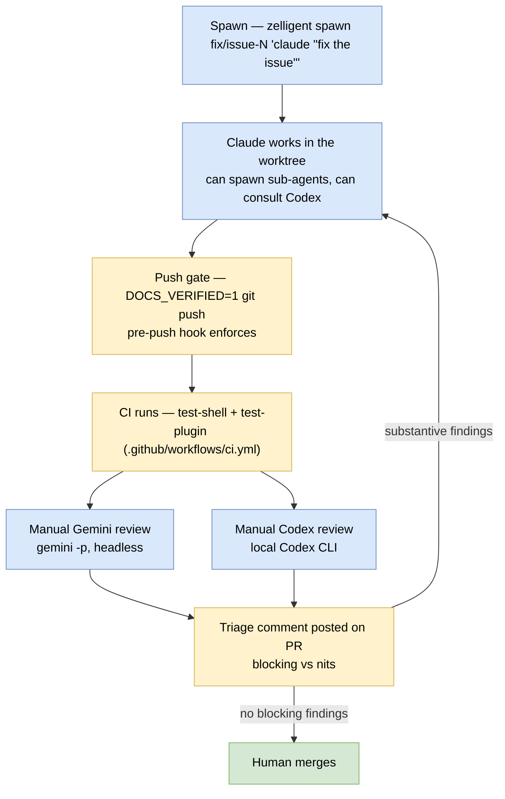

# Building zelligent with agents

Zelligent is itself built with AI coding agents. This doc is the meta-tour
of how that works in practice: what role each agent plays, how the
infrastructure makes them safe and effective, and where humans stay in
the loop.

## The cast

Three agents participate in day-to-day development:

| Agent       | Role                                                                                   | Surface (local tooling, not repo-defined)         |
|-------------|----------------------------------------------------------------------------------------|---------------------------------------------------|
| **Claude**  | Primary developer. Reads, writes, tests, ships PRs.                                    | Claude Code CLI inside a worktree pane.           |
| **Codex**   | Second opinion. Adversarial review, rescue when Claude is stuck, sanity check on diffs.| OpenAI Codex CLI (`@openai/codex`), invoked via a personal `codex:codex-rescue` Claude Code subagent + a small companion helper script. |
| **Gemini**  | Independent reviewer. Catches what Claude wrote and what Codex blessed.                | Google Gemini CLI (`@google/gemini-cli`), run headless via `gemini -p`. |

The Codex- and Gemini-related plumbing lives in the developer's local
`~/.claude` config and is not part of the zelligent repo itself; only
the Claude-side bundled plugin (`claude-plugin/`) and project skills
(`.claude/skills/`, `.claude/agents/`) ship with the repo.

The pattern is "different model for each role." Self-review by the same
model is a known weakness; an independent reviewer with different
training catches different things. Empirically on this repo:

- Gemini catches doc-and-source-of-truth mismatches and ffmpeg/CLI syntax
  nuances. (PR #128 — DEMO_SCRIPT.md mis-classification.)
- Codex catches reachability and "what does a clean checkout actually
  see" bugs. (PR #128 — broken relative link to an untracked file.)
- Both caught the same blocking issue on PR #127 (persistent-tab
  refresh loop), independently — strong signal.

## How a feature ships

## Infrastructure that makes this safe

### Isolation via worktrees

Every spawned agent gets its own git worktree under
`~/.zelligent/worktrees/<repo>/<branch>` and its own Zellij tab.
Branches don't collide on disk. Two agents working on adjacent
features can't accidentally edit the same files in the same checkout
because they have separate ones.

### `ZELLIGENT_TAB_NAME` propagation

The CLI injects `ZELLIGENT_TAB_NAME=<sanitized-branch>` into the agent
pane's environment. Anything the agent spawns inherits it. The Claude
Code hooks (next item) use it to identify which tab they belong to
when they emit status events.

### Agent status notifications via Claude Code hooks

Installed by `zelligent doctor`. The hooks live in
`claude-plugin/plugins/zelligent/hooks/hooks.json` and fire on three
Claude Code events:

| Hook event             | When                              | Pipe event           | Sidebar effect                |
|------------------------|-----------------------------------|----------------------|-------------------------------|
| `UserPromptSubmit`     | User sends a prompt to Claude     | `event=Start`        | Status → Working (green dot)  |
| `Notification` (`permission_prompt`) | Claude asks for tool approval | `event=PermissionRequest` | Status → NeedsInput (yellow) + sound |
| `Stop`                 | Claude finishes a turn            | `event=Stop`         | Status → Done (green check) + desktop notification |

Each hook runs `zellij pipe --name zelligent-status --args
event=<X>,tab=$ZELLIGENT_TAB_NAME`. The plugin filters incoming pipes
on `msg.name == "zelligent-status"` and updates per-tab status. This
is how the sidebar shows "what is every agent doing right now" at a
glance.

Full pipeline: [design-docs/agent-notifications.md](design-docs/agent-notifications.md).

### Pre-push docs gate

`.claude/hooks/pre-push-block.sh` is a Claude Code `PreToolUse` hook
that blocks `Bash` commands containing `git push` unless the command
also contains `DOCS_VERIFIED=1`. The point isn't the literal env var;
it's the forcing function — the developer (or agent) has to stop and
answer "are the docs current?" before push. The marker shows up in
shell history so it's visible later. The hook is Claude-Code-specific
and does not affect a human pushing from a normal shell.

## Skills — encoding workflows the agent can execute

Skills are markdown files with YAML frontmatter and a body that tells
the agent how to execute a workflow. Claude Code discovers them by
name/description from `.claude/skills/` (project-local) and bundled
plugin directories like `claude-plugin/plugins/zelligent/skills/`.

| Skill                       | Purpose                                                                        |
|-----------------------------|--------------------------------------------------------------------------------|
| `zelligent-spawn-claude`    | How an agent spawns sub-agents via `zelligent spawn`. Includes guard rails (don't delegate work whose output needs to come back to the current chat). |
| `dev-install`               | One-command local rebuild + install of CLI and wasm. Handles the Homebrew-Rust PATH workaround. |
| `release`                   | The release pipeline: bump VERSION, tag, push, wait for CI, update Homebrew formula, write release notes. |
| `tmux`                      | Manual proofs and ad hoc UI interaction. Wraps a Zellij session in tmux so its output is scrapeable. |

A skill is the right abstraction when a workflow is *executable but
not autonomous* — the agent shouldn't have to re-derive the steps
each time, but the steps need a human/agent in the loop to decide
what to do at each branch.

## Specialized subagents

Subagents live in `.claude/agents/`. They are full Claude instances
with a tighter tool list, a focused system prompt, and (sometimes) a
specific model override.

- **`test-driver`** — Drives UI test plans in tmux. Sonnet, restricted
  to `Bash` and `Read`, with the `tmux` skill. Reads a plan markdown
  file, runs the fixture, executes steps against a real Zellij, and
  reports pass/fail per step. See [tests/harness/README.md](../tests/harness/README.md).
- **`rust-zellij-reviewer`** — Reviews Rust code in the Zellij plugin
  context. Opus, no `Bash`/`Edit`/`Write`; has read/search/web/task
  tools. Used to validate larger plugin changes against Zellij design
  patterns; not invoked every PR.

Subagents share the workspace but get a fresh context window. They
return a single message back. Their job is to do one thing well and
leave; orchestration stays in the parent agent.

## Memory (developer-local, not in the repo)

Claude Code can maintain per-project auto-memory files outside the
repo (typically under `~/.claude/`). It captures things that aren't in
the code or the git history but need to survive across conversations:
Zellij quirks the agent rediscovered, push-gate rules, build commands
with the PATH workaround, known upstream bugs. The contents and exact
location are part of the developer's local Claude Code setup, not
part of zelligent itself; the same agents work without it, just with
less context retention between sessions.

## Where humans stay in the loop

- Picking what to work on. (The agent doesn't decide priorities.)
- Merging PRs. Even when CI is green and both reviewers have no
  blocking findings.
- Releases. The `release` skill walks the steps but waits at each
  human decision point (release notes content, Homebrew tap PR).
- Architecture decisions. Big design changes get a design-doc in
  `docs/design-docs/` written by a human and reviewed by agents.

## Patterns that don't work (yet)

- **Self-review by the same model.** Both Claude Opus and Sonnet
  miss things they would catch in someone else's code. The fix is
  to route to a different model, not to ask harder.
- **Long-running agent autonomy without checkpoints.** Empirically
  agents drift after a few dozen turns without a human anchoring
  step. Periodic recheck patterns (a scheduled or looped prompt that
  re-asks "what's the current state, what's still actionable") work
  better than open-ended autonomy.
- **Spawning sub-agents whose output needs to come back to the
  parent chat.** The `zelligent-spawn-claude` skill spells this out
  explicitly: subagents in spawned worktrees can't stream feedback
  back. For "do a thing and report to me," use the parent agent's
  subagent tool, not `zelligent spawn`.

## Related docs

- [ARCHITECTURE.md](ARCHITECTURE.md) — what zelligent itself is.
- [TESTING.md](TESTING.md) — how we verify changes.
- `claude-plugin/plugins/zelligent/skills/zelligent-spawn-claude/SKILL.md`
  — the bundled skill agents pick up after `zelligent doctor`.
- [design-docs/agent-notifications.md](design-docs/agent-notifications.md)
  — the hook + pipe pipeline.
