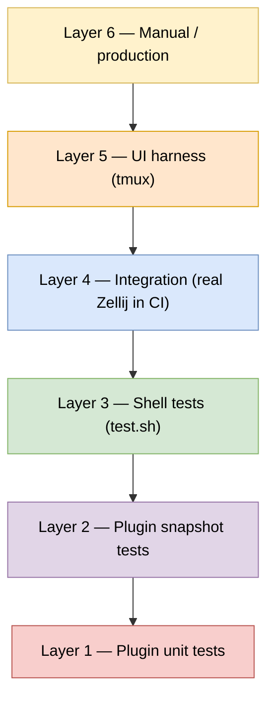

# Testing

Zelligent has six test layers, from fast and exhaustive at the bottom
to slow and partial at the top. Each layer catches different bugs; none
of them alone is enough.



The local shell gate is `bash test.sh` — it covers Layer 3 plus the
Layer 4 integration smoke when Zellij is available. Plugin unit and
snapshot tests (Layers 1 and 2) are separate `cargo test` runs. CI
runs both gates as `test-shell` and `test-plugin` jobs in
`.github/workflows/ci.yml`; both must pass before merge. The push gate
(`.claude/hooks/pre-push-block.sh`) requires `DOCS_VERIFIED=1 git push`
on top of that.

---

## Layer 1 — Plugin unit tests (~124 tests)

Where: `plugin/src/lib.rs`, inside `#[cfg(test)] mod tests`. Pure Rust,
no I/O. They test the state machine: given an `Event`, what `Action`
does the handler return, and what does the new state look like.

What they catch:

- State transitions (focus changes, mode switches, confirmation flows).
- Edge cases in parsers (`parse_branches`, `parse_worktrees`).
- The match-by-name vs match-by-position trap (tab management).
- Race-condition guards (the "user tab" mislabel that PR #127 fixed
  has a specific test pinning the pre/post-snapshot diff behavior).

What they miss:

- Anything that requires the Zellij host shim (FFI into
  `_host_run_plugin_command`). The plugin's `fire_*` helpers and the
  `execute()` Action dispatcher call into it; tests cannot link these
  in. We side-step this by extracting predicates into pure helpers and
  testing those, then trusting the thin dispatcher.
- Rendering. That's the next layer.

Run:

```bash
cd plugin && cargo test --target "$(rustc -vV | awk '/^host:/ {print $2}')"
```

The `--target` override is required because `plugin/.cargo/config.toml`
defaults to `wasm32-wasip1` and you can't run wasm test binaries on a
host runner.

---

## Layer 2 — Plugin render snapshot tests (~32 snapshots, ~27 tests)

Where: `plugin/tests/render_snapshots.rs` plus `plugin/tests/snapshots/*.snap`.
Uses [insta](https://insta.rs).

Each test constructs a `State`, calls `render_to_string(&state, rows,
cols)` — most use 20×80, with a few explicit short/narrow cases
(10×80, 5×80, 20×44) — and compares the normalized ANSI string against
a checked-in `.snap` file. (The version string in the footer is
normalized so snapshots survive version bumps.) Snapshots cover the
main modes and flows: empty, browsing, branch-picker, input,
confirmation, dim/highlight treatments.

What they catch:

- Visual regressions — gutter glyphs, color codes, dimming, viewport
  scrolling, truncation, sidebar item ordering.
- Off-by-ones in the cursor / viewport math when `selected_index`
  approaches the top or bottom of the visible window.
- Accidental introduction of non-printable bytes (the powerline glyph
  episode — see `4238cff` — silently broke Edit-tool string matching
  because the byte sequence was being dropped by some readers).

Updating: when an intentional UI change lands, regenerate with

```bash
cd plugin && INSTA_UPDATE=always cargo test \
  --target "$(rustc -vV | awk '/^host:/ {print $2}')"
```

Review each `.snap` diff before committing.

---

## Layer 3 — Shell tests (`test.sh`, ~200+ checks)

Where: `test.sh`. A single Bash file that runs in ~30 seconds. Sectioned
by `echo "<section>:"` lines that group related assertions.

What it covers (one section per topic):

| Section                       | What it checks                                                                  |
|-------------------------------|---------------------------------------------------------------------------------|
| Session name generation       | Branch → sanitized name (`/` → `-`, strip non-alnum). The label is historical: the sanitized output is what becomes the *tab* name; session names are the repo's basename. |
| Layout file generation        | Spawned-tab layout has sidebar, lazygit, status-bar, the right `cwd`, setup.sh. |
| Layout source resolution      | `.zelligent/layout.kdl` precedence over user layout, validation of placeholders.|
| Quoted agent command          | Single-quotes in agent args escape through the perl renderer and KDL emitter.   |
| Prompt delivery harness       | Positional prompts, `-p` prompts, model flags, and bare `claude` survive the emitted KDL → bash path. |
| Version and help              | `--version`, `--help`.                                                          |
| No-args behavior              | `zelligent` with no args either attaches or creates with the right layout.      |
| Stale socket timeout          | Hanging `zellij list-sessions` falls back to "create new session" after 3s.     |
| Argument validation           | `spawn` / `remove` reject empty or invalid input.                               |
| Environment checks            | Required env (`HOME`, `git`) is sanity-checked.                                 |
| Nuke subcommand               | Kills the session, then the cache, in the right order.                          |
| Doctor subcommand             | Installs the layout, plugin perms, and Claude skill idempotently.               |
| Install script contract       | `dev-install.sh` and Homebrew formula behavior stay in sync.                    |
| Query subcommands             | `list-worktrees`, `list-branches`, `show-repo` produce the TSV the plugin parses.|
| Launch mode                   | Inside-Zellij vs attach-to-existing vs new-session branch selection.            |
| Integration (requires Zellij) | (See Layer 4.)                                                                  |
| Doc index completeness        | Every `docs/design-docs/*.md` is linked from `docs/design-docs/index.md`.       |

How it works: most tests build a temp dir, stub `zellij` and `lazygit`
with shell scripts that echo their args, then run `zelligent` with
`PATH` pointing at the stubs. The Prompt delivery harness goes
further — it stubs `claude` and *executes* the emitted KDL `args` line
through `bash -lc` so the test sees what the agent would actually see.
Because `bash -lc` is a login shell that re-sources the profile and
resets `PATH`, the harness rewrites `exec claude` to the *absolute*
mock path (`$MOCK_CLAUDE`) rather than relying on `PATH` shadowing —
a bare `claude` would resolve to the real binary and recursively
re-enter the suite. As a second layer, `test.sh` exports
`ZELLIGENT_TEST_ACTIVE` and refuses to run when it is already set, so
even a bypassed mock cannot fork-bomb the machine.

What it catches:

- All the CLI's user-visible contracts (the `Usage:` lines, the
  error messages, the exit codes).
- Layout-format regressions — the most fragile surface in the codebase
  because Zellij is strict and silent about KDL parse errors.
- The two recent close-the-tab fixes (PRs #119, #127) are pinned by
  shell-test assertions that watch a mock zellij's argv log.

What it misses:

- Whether Zellij actually interprets the emitted layout correctly
  beyond the assertions we wrote. That's Layer 4.
- Anything visual.

---

## Layer 4 — Integration (live Zellij when available)

Where: the `Integration (requires Zellij):` section of `test.sh` (last
~30 lines).

How it works: spins up a real Zellij session via
`zellij attach --create-background`, spawns a worktree into it, and
asserts on `zellij action dump-layout` output. `test.sh` skips this
section when `zellij` isn't on `PATH` — so it runs locally (when
Zellij is installed) and on CI runners that already have Zellij.
Note: the current `ci.yml` does not install Zellij before `test-shell`,
so this layer's coverage on CI depends on the runner image.

What it catches:

- KDL that parses in our perl renderer but fails at Zellij's KDL parser.
- Split-direction semantics (`split_direction="Vertical"` is the
  left/right split, not what the word says — `dump-layout` is the
  authoritative check).

Plugin path: real Zellij actually loads the sidebar plugin, so this
layer needs a real wasm — the `ZELLIGENT_PLUGIN_SRC=$SCRIPT` fallback
the unit tests use (a shell script) fails wasm validation ("magic
header not detected") and makes `zellij action new-tab` exit 2. This
was the root cause of the long-standing `script exits 0 (integration)`
failure. The section now prefers the dev build
(`plugin/target/wasm32-wasip1/release/zelligent-plugin.wasm`), falls
back to the Homebrew-installed copy, and if neither exists skips only
the exit-code assertion with a visible warning.

CI definition is in `.github/workflows/ci.yml`: two macOS jobs,
`test-shell` and `test-plugin`, both required to pass before merge.

---

## Layer 5 — UI harness (`tests/harness/`, tmux-driven)

Where: `tests/harness/plans/*.md`, run by the
`test-driver` subagent (`.claude/agents/test-driver.md`). Not in CI.

How it works:

- Each **plan** is a markdown file with YAML frontmatter specifying a
  setup `fixture` and a `launch` command, then a numbered list of test
  steps with expectations.
- The `test-driver` subagent reads the plan, runs the fixture, opens a
  dedicated tmux session on an isolated socket (`zt-driver-test`),
  launches Zellij in window 0, and drives input from window 1.
- After each step, it captures `tmux capture-pane` output and verifies
  visible expectations — sidebar contents, focused tab, prompts,
  notifications.
- The driving rules that make runs trustworthy (build-identity gate,
  SGR click protocol, focus-claim semantics, capture/teardown
  discipline, what must never run) are consolidated in
  [tests/harness/README.md](../tests/harness/README.md) under
  "Driving rules (the playbook)" — read it before writing or running
  a plan.

Active plans live in `tests/harness/plans/`:

- `empty-repo.md` — first-run behavior with no worktrees.
- `with-worktrees.md` — sidebar populated, switching tabs.
- `sidebar-layout-smoke.md` — split direction, widths, sidebar visible.
- `sidebar-mouse-interaction.md` — click-to-focus.

What this layer catches that shell tests can't:

- Cursor placement, color rendering inside a real terminal, redraw
  behavior on resize.
- Modal flows that span multiple events (open input, type, confirm).
- Tab focus surviving a worktree spawn from inside the sidebar.

Cost: each plan takes 30–90 seconds and requires a Claude session to
drive. We run these on demand — when something visible has changed —
not on every commit. For ad hoc inspection, the
[tmux skill](../.claude/skills/tmux/SKILL.md) gives you the same
primitives without the plan harness.

---

## Layer 6 — Manual / production

What's left uncovered by 1–5:

- The actual feel of spawning and removing worktrees in real Zellij,
  with a real agent (Claude or Codex) running in the panes. Layer 5
  uses a stub launcher and doesn't watch a live agent.
- Resurrection — re-attaching to a session whose layout was persisted
  to Zellij's cache. The cwd bug (PR #105) was hit in production
  before we knew to look for it.
- Notifications — `osascript` and `afplay` only work on macOS with a
  desktop session; nothing in CI checks them.
- Homebrew installs — the formula contract is shell-tested but the
  actual brew install / upgrade path is exercised by hand.

For these we rely on:

- **Dogfooding.** The repo's `.claude/skills/dev-install/SKILL.md` and
  `.claude/skills/release/skill.md` are the canonical install paths
  for working on zelligent inside zelligent. The contributor is also
  the first user of every change.
- **Release checklists.** The `release` skill walks through
  bump → tag → CI → release notes → Homebrew formula.
- **Demo recording.** The README demo is regenerated when behavior
  changes; the act of recording it surfaces UI rough edges (the
  pipeline for that lives in `docs/RECORDING_DEMOS.md` on the
  recording-demos branch).

---

## What each layer is good for, in one sentence

| Layer                | One-sentence summary                                                              |
|----------------------|-----------------------------------------------------------------------------------|
| 1. Plugin unit       | "Given an event, does the state machine do the right thing?" Fast and exhaustive. |
| 2. Plugin snapshot   | "Does the sidebar still render byte-for-byte the way it did before?" Catches visual regressions. |
| 3. Shell `test.sh`   | "Does the CLI's user-visible behavior still hold?" The big one — runs in ~30s.    |
| 4. Integration       | "Does Zellij actually accept the layout we emit?" Runs locally and on CI runners that have Zellij. |
| 5. UI harness (tmux) | "Does the live, redrawn UI behave correctly under input?" On-demand, agent-driven.|
| 6. Manual            | "Does the thing actually feel right when a real human runs it?" Dogfooding.       |

---

## Push gate

Not strictly a test layer, but worth knowing: `.claude/hooks/pre-push-block.sh`
is a Claude Code `PreToolUse` hook that blocks `Bash` invocations of
`git push` unless the command also contains `DOCS_VERIFIED=1`. It
forces the agent (or developer working inside Claude Code) to
acknowledge that `docs/` and `AGENTS.md` are up to date — *or*
explicitly state they don't need updates. Pushing from a normal
shell isn't blocked; CI is the contract, this hook is the cultural
contract for agent-driven pushes.

## Related docs

- [BUILD.md](BUILD.md) — exact commands and paths.
- [ARCHITECTURE.md](ARCHITECTURE.md) — what the system is, why it splits the way it does.
- [BUILDING_WITH_AGENTS.md](BUILDING_WITH_AGENTS.md) — how the tests
  feed back into the agent-driven dev loop.
- `tests/harness/README.md` — UI harness specifics and the
  `test-driver` subagent.
